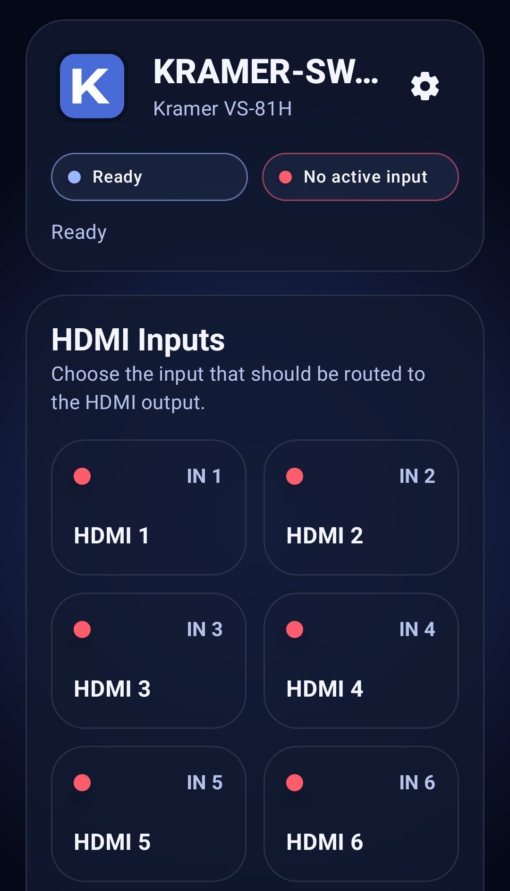
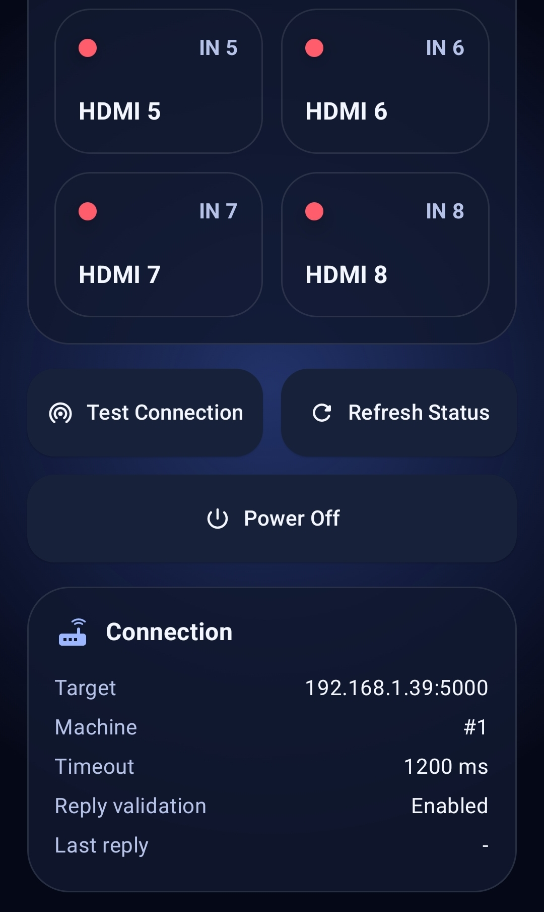
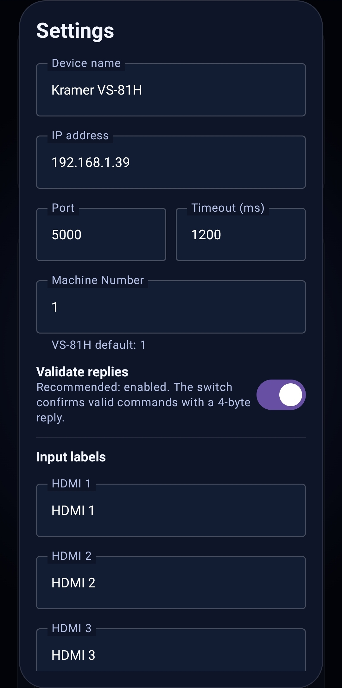
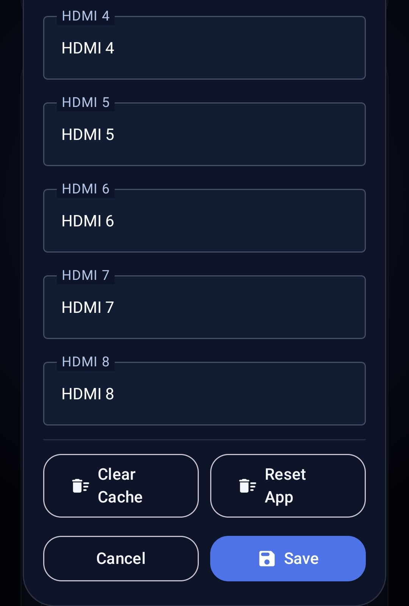

# KRAMER-SWITCH

Native Android remote app for the Kramer VS-81H 8x1 HDMI switcher.

### By complicatiion aka sksdesign aka sven404 17.05.2026

## Target Device

- Model: Kramer VS-81H
- Control: Ethernet / TCP Socket
- Protocol: Kramer Protocol 2000
- Default IP: `192.168.1.39`
- Default TCP port: `5000`
- Default machine number: `1`

The app sends raw 4-byte Kramer Protocol 2000 packets. It does not use HTTP, REST or a browser-based web API.

## Previews






## Features

- 8 HDMI input buttons for VS-81H input 1-8
- OFF button to disconnect the output
- Active-input indicator with green/red status dots
- Connection test
- Active-input refresh using Protocol 2000 status request
- Settings dialog
  - Device name
  - Switch IP address
  - TCP port
  - Timeout
  - Machine number
  - Reply verification on/off
  - Custom input labels
  - Clear cache
  - Reset app settings
- Dark Material 3 UI with blue accent colors based on the supplied SVG logo
- Unit tests for command generation and reply parsing

## Build

Open the folder in Android Studio and run the app module.

Recommended environment:

- Android Studio current stable release
- JDK 17 or newer
- Android SDK / Build Tools installed for compile SDK 35
- Internet access during the first Gradle sync

Gradle plugins used:

- Android Gradle Plugin `8.13.2`
- Kotlin `2.3.20`
- Jetpack Compose BOM `2026.04.01`

## First setup

1. Put the VS-81H into the same LAN/VLAN as the Android device.
2. Give the VS-81H a fixed IP address.
3. Allow TCP traffic from the Android device to the VS-81H on port `5000`.
4. Open KRAMER-SWITCH.
5. Open settings with the gear icon.
6. Enter the VS-81H IP address.
7. Keep port `5000` unless the switch was configured differently.
8. Keep Machine Number `1` unless your Kramer device was configured otherwise.
9. Use **Test**.
10. Use **Status** or select HDMI 1-8.

## Protocol mapping

For a single VS-81H with Machine Number 1 and Output 1:

| App action | Protocol 2000 hex |
|---|---|
| HDMI 1 | `01 81 81 81` |
| HDMI 2 | `01 82 81 81` |
| HDMI 3 | `01 83 81 81` |
| HDMI 4 | `01 84 81 81` |
| HDMI 5 | `01 85 81 81` |
| HDMI 6 | `01 86 81 81` |
| HDMI 7 | `01 87 81 81` |
| HDMI 8 | `01 88 81 81` |
| OFF / disconnect | `01 80 81 81` |
| Request active input | `05 80 81 81` |

The switch is expected to reply with the same command with the destination/reply bit set in the first byte, for example:

- Sent: `01 83 81 81`
- Expected reply/event: `41 83 81 81`

## Important notes

- Android and the VS-81H must be able to reach each other directly on TCP port `5000`.
- Some Kramer units can disable replies. If your switch performs the action but the app reports a missing reply, disable **Antwort prüfen** in settings.
- The active input can be read through a Protocol 2000 status request. If the device firmware does not answer this request reliably, the app still tracks the last successfully switched input.
- Android cannot fully clear its own app storage like the system settings screen can. The app reset clears its SharedPreferences, cached data and stored active-input state.

## Project structure

```text
app/src/main/java/de/sksdesign/kramerswitch/
  MainActivity.kt                         UI and app state
  core/KramerProtocol.kt                  Protocol 2000 packet creation/parsing
  core/KramerClient.kt                    TCP socket client
  data/AppSettings.kt                     SharedPreferences settings store
app/src/test/java/de/sksdesign/kramerswitch/core/
  KramerProtocolTest.kt                   JVM tests for protocol integrity
app/src/main/res/drawable/
  kramer_logo.xml                         Android vector logo
app/src/main/assets/
  logo_source.svg                         Original supplied SVG source
```

## License

Copyright (c) 2026 complicatiion aka sksdesign aka sven404
All rights reserved unless explicitly granted below or otherwise mentioned/licensed, or generally based on an open-source license.

See further details in:

LICENSE.md


## Disclaimer

KRAMER-SWITCH is an unofficial hobby project and is not affiliated with, endorsed by, or sponsored by Kramer Electronics Ltd. or any related company.

This app was created as a private/community tool to control a Kramer VS-81H HDMI switch over the local network. All product names, trademarks, and brands belong to their respective owners.


## Note

By using, copying, modifying, or redistributing this project, you agree to the terms of this license.

Copyright (c) 2026 complicatiion aka sksdesign aka sven404 All rights reserved unless explicitly granted below or otherwise mentioned/licensed, or generally based on an open-source license.


